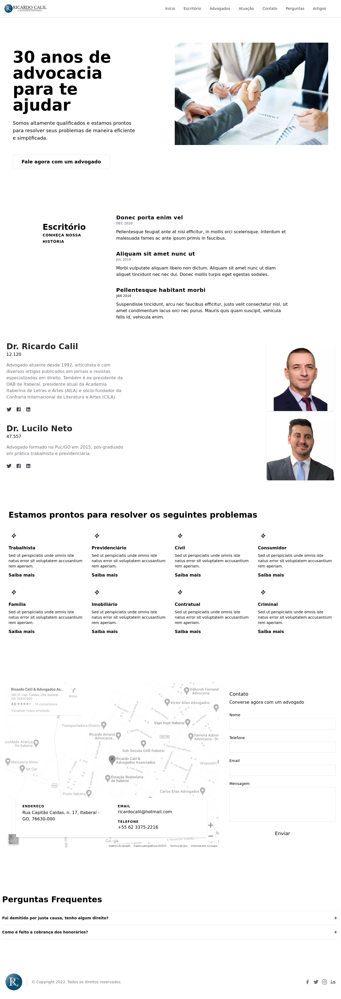

<br />
<p align="center">
  <h3 align="center">Ricardo Calil & Advogados Associados</h3>

  <p align="center">
	Ricardo Calil & Advogados Associados is a law firm based in Itaberaí, Goiás, Brazil.
	This project is a landing page for the website of the firm.
	<br />
	:construction: Currently this website is under construction. The preview is available on the <a href="https://new.ricardocalil.adv.br">new Ricardo Calil website</a> :construction:
    <br />
	<br />
    <a href="https://github.com/xandao-dev/ricardo-calil"><strong>Explore the docs »</strong></a>
    <br />
    <a href="https://github.com/xandao-dev/ricardo-calil/issue">Report Bug</a>
    ·
    <a href="https://github.com/xandao-dev/ricardo-calil/issues">Request Feature</a>
  </p>
</p>

<!-- TABLE OF CONTENTS -->
<details open="open">
  <summary>Table of Contents</summary>
  <ol>
    <li>
      <a href="#about-the-project">About The Project</a>
      <ul>
        <li><a href="#features">Features</a></li>
        <li><a href="#built-with">Built With</a></li>
      </ul>
    </li>
    <li>
      <a href="#getting-started">Getting Started</a>
      <ul>
        <li><a href="#installation">Installation</a></li>
      </ul>
    </li>
    <li><a href="#usage">Usage</a></li>
    <li><a href="#roadmap">Roadmap</a></li>
    <li><a href="#contributing">Contributing</a></li>
    <li><a href="#license">License</a></li>
    <li><a href="#contact">Contact</a></li>
    <li><a href="#acknowledgements">Acknowledgements</a></li>
  </ol>
</details>

<!-- ABOUT THE PROJECT -->

## About The Project

<div align="center">
  <a href="https://github.com/xandao-dev/ricardo-calil">
    
  </a>
</div>

### Features

-   Hero section
-   Office section
-   Lawyers section
-   Expertise area section
-   Map section with contact information
-   Contact form
-   Frequently asked questions section
-   Articles page (blog)
-   Expertise areas pages (coming soon)
-   Dark mode toggle (coming soon)
-   Responsive design (coming soon)
-   Calculators for lawyers (coming soon)
-   SEO friendly (coming soon)

### Built With

-   [Nuxt.js](https://nuxtjs.org/) - The intuitive Vue Framework
-   [Vue.js 2](https://vuejs.org/) - A progressive framework for web development
-   [Tailwind CSS](https://tailwindcss.com/) - A utility-first CSS framework

<!-- GETTING STARTED -->

## Getting Started

To get a local copy up and running follow these simple steps.

### Installation

1. Clone the repo
    ```sh
    git clone https://github.com/xandao-dev/ricardo-calil.git
    ```
2. Install dependencies
    ```sh
    cd ricardo-calil
    npm install # or yarn install
    ```
3. Set environment variables. Create a ".env" file based on ".env.example".
    - GTM_ID for Google Tag Manager
    - PRISMIC_ENDPOINT for the blog
    - WEBSITE_HOME_DOMAIN used for some configs

<!-- USAGE EXAMPLES -->

## Usage

-   Starts the development server
    ```sh
    npm run dev # or yarn dev
    ```
-   Launch production server
    ```sh
    npm run build # or yarn build
    npm run start # or yarn start
    ```
-   Generate a static version of the website
    ```sh
    npm run generate # or yarn generate
    ```

<!-- ROADMAP -->

## Roadmap

See the [open issues](https://github.com/xandao-dev/ricardo-calil/issues) for a list of proposed features (and known issues).

<!-- CONTRIBUTING -->

## Contributing

Contributions are what make the open source community such an amazing place to be learn, inspire, and create. Any contributions you make are **greatly appreciated**.

1. Fork the Project
2. Create your Feature Branch (`git checkout -b feature/AmazingFeature`)
3. Commit your Changes (`git commit -m 'Add some AmazingFeature'`)
4. Push to the Branch (`git push origin feature/AmazingFeature`)
5. Open a Pull Request

<!-- LICENSE -->

## License

All rights reserved.

<!-- CONTACT -->

## Contact

Alexandre Calil - [Linkedin](https://www.linkedin.com/in/xandao-dev/) - [alexandre@xandao.dev](mailto:alexandre@xandao.dev)

Project Link: [https://github.com/xandao-dev/ricardo-calil](https://github.com/xandao-dev/ricardo-calil)

## Acknowledgements

-   [TypeScript](https://www.typescriptlang.org/) - strongly typed JavaScript
-   [eslint](https://github.com/eslint/eslint) - code quality linter
-   [prettier](https://github.com/prettier/prettier) with [eslint plugin](https://github.com/prettier/eslint-plugin-prettier) and [eslint config](https://github.com/prettier/eslint-config-prettier) - formatter linter with eslint integration
-   [stylelint](https://stylelint.io/) - linter for css
-   [mdi](https://materialdesignicons.com/) - icons used in the project
-   [jest](https://jestjs.io/) - unit testing framework
-   [babel](https://babeljs.io/) - converts modern JavaScript into backwards compatible code
-   [dotenv](https://github.com/motdotla/dotenv) - environment variables
